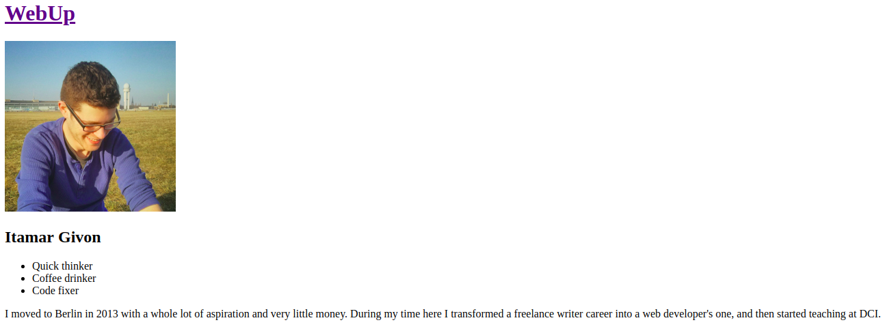

# Team Website

## Aufgabe I

- [x] Erstelle eine leere Datei in dem Ordner `team`. Die Datei sollte dein Namen haben:  `<dein_Name>.html` (ersetze `<dein_Name>` mit deinen echten Namen, z.B. für Nathalie wäre es `nathalie.html`).
- [x] Füge die Grundstruktur für eine html-Datei ein. Füge auch ein `meta`-Tag mit dem Namen `author` und dem Content mit deinem Namen ein.
- [x] Ändere den Title vom Dokument zu `WebUp | <dein_Name>` (ersetze `<dein_Name>` mit deinen echten Namen)
- [x] Verlinke das Stylesheet in `styles/main.css`.

---

## Aufgabe II

- [x] Füge eine Überschrift ein mit dem Text "WebUp".
- [x] Füge ein Bild von dir in die `img`-Ordner ein. 
- [x] Füge dieses Bild unter der Überschrift ein. Der alt-Text und das Tooptip sollte dein Namen beinhalten. Das Bild sollte genau 250 px hoch sein. Das Bild sollte die Klasse `profile-pic` haben.
- [x] Füge eine kleinere Überschrift mit deinem Namen ein. Diese Überschrift sollte die Klasse `profile-name` haben.
- [x] Unter der Überschrift, füge eine Punktliste ein mit drei Wörter oder Phrasen, die dich beschreiben.
- [x] Füge noch ein Paragraph hinzu, der mehr Info über dich enthält.

---

## Aufgabe III

- [x] In der html-Datei, die du gerade erstellt hast, füge einen Link zu der `index.html`-Datei ein. Wenn du auf diesem Link klickst, solltest du auf der Hauptseite landen.
- [x] In `index.html`, füge ein kleineres Foto von dir ein (Größe: 50x50 px) und füge dein Namen zu der Liste unter der Überschrift "Unser Team"
- [x] Verlinke das Bild und deinen Namen zu deiner eigenen Seite (`<dein_Name>.html`). (Mit 2 Links)

## Bonusaufgabe 

- [x] Finde heraus wie man Html-tags schreiben muss, damit man sie in dem Browser sieht, d.h. Wie muss man `
` schreiben, damit im Brower auch genau diese Zeicher erscheinen. 
- [x] Füge dein Lieblings-Tag hinzu (so dass man ihn sehen kann) in der Punktliste mit Infos über dich auf deiner Seite.
- [x] Baue eine Navbar, die auf beiden Seiten sichtbar ist, mit Links zu deiner Startseite und Profilseite. 
---
### Homepage

### Profile

